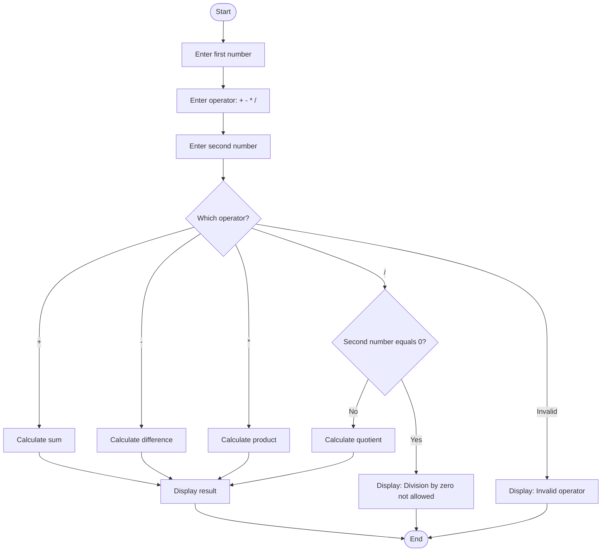

# Calculator Program (C)

**CodeAlpha Internship — Task 1**

A simple console-based calculator built in C that performs addition, subtraction, multiplication, and division, with built-in protection against division by zero.

---

## 📋 Table of Contents
- [Overview](#overview)
- [Features](#features)
- [Program Flow](#program-flow)
- [Flowchart](#flowchart)
- [How to Compile & Run](#how-to-compile--run)
- [Sample Output](#sample-output)
- [Concepts Used](#concepts-used)
- [Future Improvements](#future-improvements)

---

## Overview

This program takes two numbers and an arithmetic operator from the user, then performs the corresponding calculation. It's a foundational C project that demonstrates clean control flow using `switch-case` logic, along with a critical real-world safeguard: preventing a crash when dividing by zero.

---

## Features

- ✅ Supports addition (`+`), subtraction (`-`), multiplication (`*`), and division (`/`)
- ✅ Clean `switch-case` based operator selection
- ✅ Division-by-zero validation with a clear error message
- ✅ Handles invalid operator input gracefully

---

## Program Flow

1. The program prompts the user to enter the first number.
2. The user enters an operator (`+`, `-`, `*`, or `/`).
3. The user enters the second number.
4. The program checks the operator using `switch-case`:
   - For `/`, it first checks whether the second number is `0`. If so, it displays an error instead of attempting the calculation.
   - For all other valid operators, it performs the calculation and displays the result.
5. If an invalid operator is entered, an error message is shown.

---

## Flowchart



---

## How to Compile & Run

```bash
gcc -std=c11 calculator.c -o calculator
./calculator
```

---

## Sample Output

```
===================================================
               SIMPLE CALCULATOR
===================================================
Enter first number: 10
Enter operator (+, -, *, /): /
Enter second number: 0
---------------------------------------------------
Error: Division by zero is not allowed!
===================================================
```

---

## Concepts Used

- `switch-case` control flow
- Conditional validation logic
- Basic input/output using `scanf`/`printf`
- Defensive programming (preventing runtime crashes)

---

## Future Improvements

- Add support for more operations (modulus, exponentiation, square root)
- Allow chained calculations (e.g., a running calculator loop)
- Add support for decimal precision configuration

---

*Built as part of the CodeAlpha C Programming Internship.*
